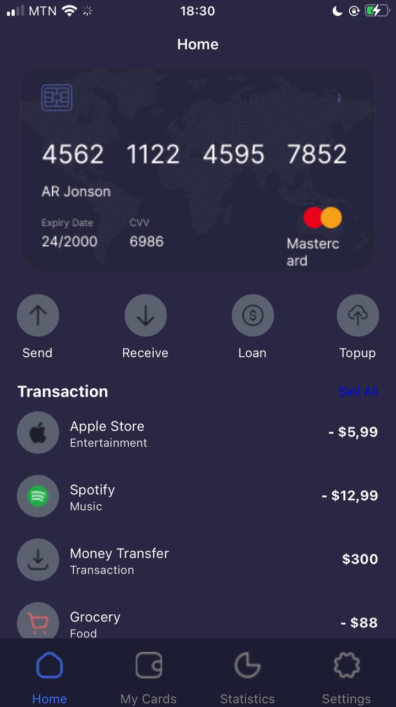
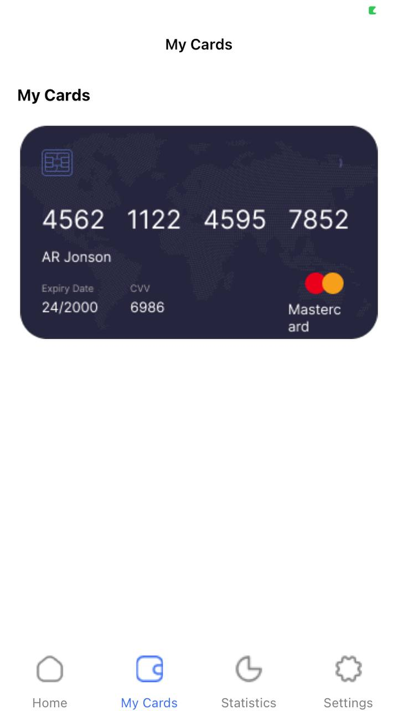
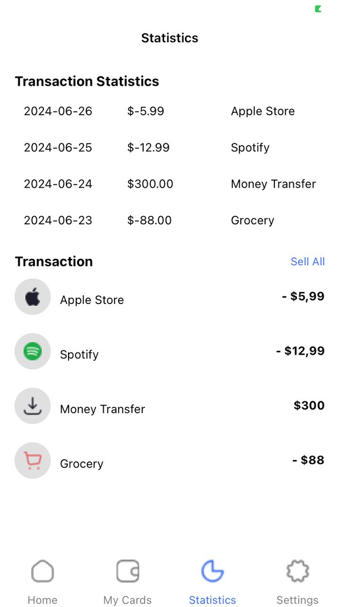
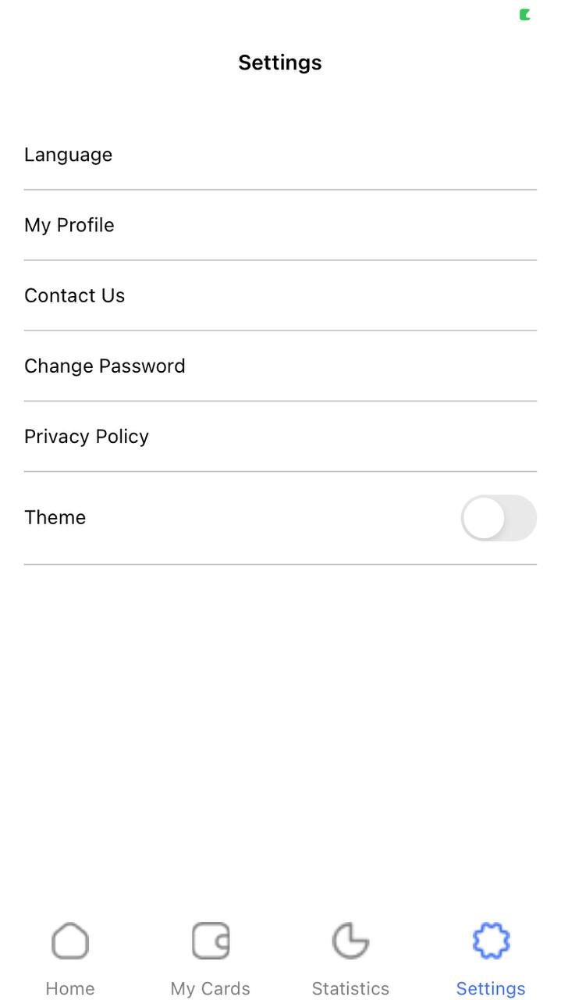

# rn-assignment5-11217289
## Screenshots
         
Here's an example of a README file with a brief description of how the application was built and placeholders for screenshots of the app:

---

# React Native Assignment 5

## Project Overview

This project is a mobile application developed using React Native as part of DCIT202 MOBILE APPLICATION DEVELOPMENT Assignment 5. The application follows a UI mockup design, includes bottom tab navigation, and allows users to switch between light and dark themes. Custom components are used throughout the application to closely match the provided UI design.

## Features

- Bottom Tab Navigation: The application includes a bottom tab navigation with Home and Settings screens.
- Theme Switching: Users can switch between light and dark themes.
- Custom Components: The application is styled using custom components to closely match the provided UI mockup.

## How the Application Was Built

1. Project Setup
   - The project was bootstrapped using expo init to create a new React Native application.
   - Necessary dependencies were installed, including @react-navigation/native, @react-navigation/bottom-tabs, and react-native-gesture-handler.

2. Project Structure
   - The project is organized into several directories: assets for images, screens for screen components, navigation for navigation setup, and theme for theme context management.
   - Custom components were created to match the UI mockup design.

3. Bottom Tab Navigation
   - The bottom tab navigation was implemented using createBottomTabNavigator from @react-navigation/bottom-tabs.
   - Two main screens, Home and Settings, were added to the tab navigator.

4. Theme Switching
   - A context provider, ThemeContext, was created to manage light and dark themes.
   - The Settings screen includes a switch to toggle between themes.

5. Styling
   - The application was styled using StyleSheet from react-native to closely match the provided UI mockup.
   - Custom components and styles were created to ensure a consistent look and feel.

## Project Structure

The project structure is organized as follows:

my-project/
  ├── assets/
  │   └── profile.png
  ├── node_modules/
  ├── screens/
  │   ├── HomeScreen.js
  │   └── SettingsScreen.js
  ├── navigation/
  │   └── MainTabNavigator.js
  ├── theme/
  │   └── ThemeContext.js
  ├── App.js
  ├── package.json
  └── ...

## Installation

1. Clone the Repository

      git clone https://github.com/yourusername/rn-assignment5-11263775.git
   

2. Navigate to the Project Directory

      cd rn-assignment5-11263775
   

3. Install Dependencies

      npm install
   

4. Start the Metro Bundler

      npx react-native start
   

5. Run the Application

   For Android:

      npx react-native run-android
   

   For iOS:

      npx react-native run-ios
   

---
